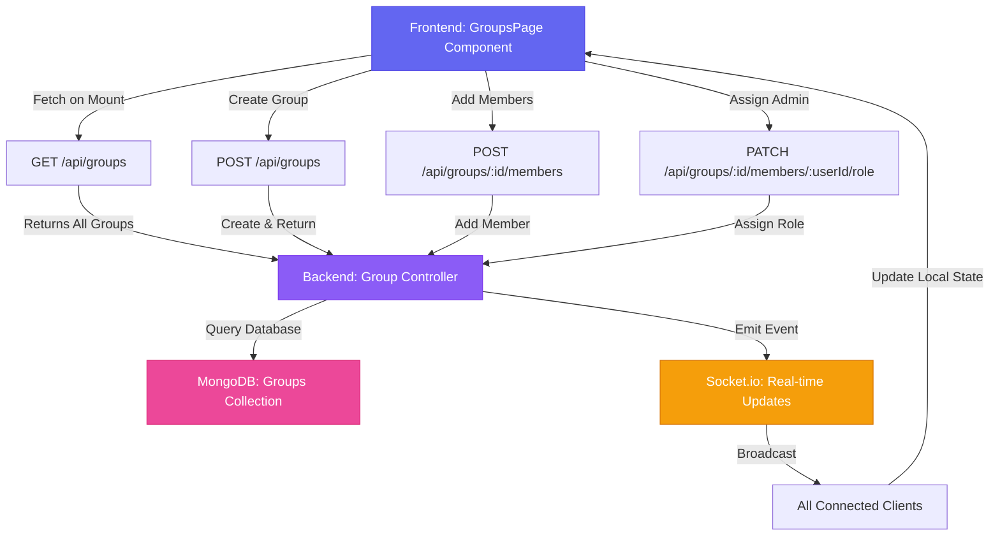
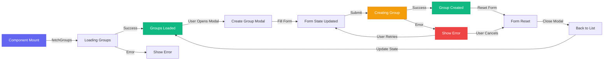

# Design Document: Groups Visibility and State Fix

## Overview

This design addresses two critical issues in the Groups & Clubs feature:

1. **Groups not visible from other accounts**: The frontend uses hardcoded `MOCK_GROUPS` and never fetches real groups from the backend API, causing groups created by one user to be invisible to other users.

2. **Members being added multiple times**: The `invitedMembers` state is not reset after group creation, and the `assignAsAdmin` checkbox persists, causing previously invited members to appear again when creating subsequent groups.

The solution implements real-time group fetching from the backend API and proper state cleanup after successful operations, ensuring groups are visible across all accounts and form state is properly managed.

---

## Architecture



---

## Components and Interfaces

### Frontend: GroupsPage Component

**Purpose**: Manage group list display, group creation, and member invitation with real-time updates.

**Key State Management**:
```javascript
// Groups list (fetched from backend)
const [groups, setGroups] = useState([]);

// Group creation form state
const [showCreateGroupModal, setShowCreateGroupModal] = useState(false);
const [createStep, setCreateStep] = useState(1);
const [groupName, setGroupName] = useState("");
const [groupDescription, setGroupDescription] = useState("");
const [groupType, setGroupType] = useState("CLUB");
const [joinPolicy, setJoinPolicy] = useState("PUBLIC");
const [messagePermission, setMessagePermission] = useState("everyone");
const [assignAsAdmin, setAssignAsAdmin] = useState(false);
const [memberSearch, setMemberSearch] = useState("");
const [memberResults, setMemberResults] = useState([]);
const [invitedMembers, setInvitedMembers] = useState([]);
const [isCreatingGroup, setIsCreatingGroup] = useState(false);

// Error handling
const [groupCreationError, setGroupCreationError] = useState(null);
const [errorContext, setErrorContext] = useState(null);
```

**Key Methods**:

#### 1. fetchGroups()
```javascript
PROCEDURE fetchGroups()
  INPUT: none
  OUTPUT: void (updates groups state)
  
  SEQUENCE
    token ← localStorage.getItem("token")
    
    TRY
      response ← axios.get(API_URL + "/groups", {
        headers: { Authorization: "Bearer " + token }
      })
      
      groups ← response.data.data
      setGroups(groups)
      
    CATCH error
      console.error("Error fetching groups:", error)
      // Fallback to empty array, show error toast
      setGroups([])
    END TRY
  END SEQUENCE
END PROCEDURE
```

**Preconditions**:
- User is authenticated (token exists in localStorage)
- Backend API is accessible

**Postconditions**:
- `groups` state is updated with fetched data
- If error occurs, `groups` is set to empty array
- Error is logged to console

**Loop Invariants**: N/A

---

#### 2. resetCreateGroupModal()
```javascript
PROCEDURE resetCreateGroupModal()
  INPUT: none
  OUTPUT: void (resets all form state)
  
  SEQUENCE
    setShowCreateGroupModal(false)
    setCreateStep(1)
    setGroupName("")
    setGroupDescription("")
    setGroupType("CLUB")
    setJoinPolicy("PUBLIC")
    setMessagePermission("everyone")
    setAssignAsAdmin(false)           // CRITICAL: Reset checkbox
    setMemberSearch("")
    setMemberResults([])
    setInvitedMembers([])             // CRITICAL: Reset invited members
    setGroupCreationError(null)
    setErrorContext(null)
  END SEQUENCE
END PROCEDURE
```

**Preconditions**:
- Modal is open (optional, can be called anytime)

**Postconditions**:
- All form state variables reset to initial values
- Modal is closed
- No error messages displayed
- Form is ready for next group creation

**Loop Invariants**: N/A

---

#### 3. handleCreateGroup()
```javascript
PROCEDURE handleCreateGroup()
  INPUT: none
  OUTPUT: void (creates group and updates UI)
  
  SEQUENCE
    // Validation
    IF groupName.trim() IS EMPTY THEN
      RETURN
    END IF
    
    // Clear previous errors
    setGroupCreationError(null)
    setErrorContext(null)
    setIsCreatingGroup(true)
    
    TRY
      token ← localStorage.getItem("token")
      
      // Step 1: Create group
      payload ← {
        name: groupName,
        description: groupDescription,
        type: groupType,
        joinPolicy: joinPolicy,
        messagePermission: messagePermission
      }
      
      response ← axios.post(API_URL + "/groups", payload, {
        headers: { Authorization: "Bearer " + token }
      })
      
      newGroup ← response.data.data
      
      // Step 2: Add invited members
      FOR EACH member IN invitedMembers DO
        memberId ← member.id OR member._id
        memberName ← member.name OR "Unknown"
        
        TRY
          // Add member to group
          axios.post(
            API_URL + "/groups/" + newGroup._id + "/members",
            { userId: memberId },
            { headers: { Authorization: "Bearer " + token } }
          )
          
          // Step 3: Assign admin role if checkbox is checked
          IF assignAsAdmin THEN
            adminRole ← newGroup.roles.find(r => r.name === "Admin")
            IF adminRole EXISTS THEN
              axios.patch(
                API_URL + "/groups/" + newGroup._id + "/members/" + memberId + "/role",
                { roleId: adminRole._id },
                { headers: { Authorization: "Bearer " + token } }
              )
            END IF
          END IF
          
        CATCH memberError
          // Log error but continue with other members
          console.error("Error adding member:", memberError)
          setGroupCreationError("Failed to add member: " + memberName)
        END TRY
      END FOR
      
      // Step 4: Update local UI with new group
      newGroupUI ← {
        id: newGroup._id,
        name: newGroup.name,
        type: newGroup.type.toLowerCase(),
        icon: newGroup.name.substring(0, 2).toUpperCase(),
        description: newGroup.description,
        members: newGroup.stats.memberCount OR 1,
        isMember: true,
        from: "#6366f1",
        to: "#8b5cf6",
        lastMsg: "Group created!",
        lastTime: "Just now",
        unread: 0
      }
      
      setGroups(prev => [newGroupUI, ...prev])
      
      // Step 5: Reset form and close modal
      resetCreateGroupModal()
      
    CATCH error
      errorMessage ← error.response.data.message OR error.message
      console.error("Group creation error:", error)
      setGroupCreationError(errorMessage)
      setErrorContext({
        operation: "groupCreation",
        status: error.response.status,
        message: errorMessage
      })
    END TRY
    
    setIsCreatingGroup(false)
  END SEQUENCE
END PROCEDURE
```

**Preconditions**:
- User is authenticated
- Group name is not empty
- Backend API is accessible

**Postconditions**:
- Group is created on backend
- Invited members are added to group
- Admin roles assigned if checkbox was checked
- Local `groups` state is updated with new group
- Form state is completely reset
- Modal is closed
- If error occurs, error message is displayed

**Loop Invariants**:
- All previously processed members remain added
- Processing continues even if individual member addition fails

---

#### 4. useEffect Hook for Fetching Groups
```javascript
PROCEDURE useEffect_FetchGroups()
  INPUT: none (runs on component mount)
  OUTPUT: void (fetches groups on mount)
  
  SEQUENCE
    // Fetch groups when component mounts
    fetchGroups()
    
    // Optional: Set up polling or socket listener for real-time updates
    // socket.on("group_created", (newGroup) => {
    //   setGroups(prev => [newGroup, ...prev])
    // })
  END SEQUENCE
END PROCEDURE
```

**Preconditions**:
- Component is mounted
- User is authenticated

**Postconditions**:
- Groups are fetched from backend
- `groups` state is populated
- Real-time listeners are set up (if implemented)

**Loop Invariants**: N/A

---

### Backend: Group Controller

**Purpose**: Handle group creation, member management, and data persistence.

**Key Endpoints**:

#### 1. GET /api/groups
```javascript
PROCEDURE getGroups()
  INPUT: none (uses authenticated user from token)
  OUTPUT: { success: boolean, data: Group[], message: string }
  
  SEQUENCE
    TRY
      groups ← Group.find()
        .populate("members.userId", "name avatar handle")
        .populate("owner", "name avatar")
        .sort({ createdAt: -1 })
      
      RETURN {
        success: true,
        data: groups,
        message: "Groups fetched successfully"
      }
      
    CATCH error
      console.error("Error fetching groups:", error)
      RETURN {
        success: false,
        message: "Error fetching groups",
        error: error.message
      }
    END TRY
  END SEQUENCE
END PROCEDURE
```

**Preconditions**:
- User is authenticated
- Database connection is active

**Postconditions**:
- Returns all groups from database
- Groups are sorted by creation date (newest first)
- Member and owner data are populated

**Loop Invariants**: N/A

---

#### 2. POST /api/groups
```javascript
PROCEDURE createGroup()
  INPUT: { name, description, type, college, joinPolicy, messagePermission }
  OUTPUT: { success: boolean, data: Group, message: string }
  
  SEQUENCE
    user ← User.findOne({ email: req.user.email })
    
    IF user IS NULL THEN
      RETURN { success: false, message: "User not found" }
    END IF
    
    IF name.trim() IS EMPTY THEN
      RETURN { success: false, message: "Group name is required" }
    END IF
    
    // Create default channels
    defaultChannels ← [
      { name: "general", type: "TEXT", messagePermissions: messagePermission },
      { name: "announcements", type: "ANNOUNCEMENT", messagePermissions: "admin" }
    ]
    
    // Create default roles
    defaultRoles ← [
      { name: "Owner", permissions: ["*"] },
      { name: "Admin", permissions: ["MANAGE_CHANNELS", "KICK_MEMBERS", ...] },
      { name: "Moderator", permissions: ["MANAGE_MESSAGES", ...] },
      { name: "Member", permissions: ["SEND_MESSAGES", "READ_MESSAGES"] }
    ]
    
    TRY
      newGroup ← Group.create({
        name: name,
        description: description,
        type: type OR "CLUB",
        college: college OR user.college,
        owner: user._id,
        admins: [user._id],
        members: [{ userId: user._id, joinedAt: new Date() }],
        joinPolicy: joinPolicy OR "PUBLIC",
        channels: defaultChannels,
        roles: defaultRoles,
        isEncrypted: true,
        stats: { memberCount: 1, lastActivity: new Date() }
      })
      
      populated ← Group.findById(newGroup._id)
        .populate("members.userId", "name avatar handle")
        .populate("owner", "name avatar")
      
      RETURN {
        success: true,
        data: populated,
        message: "Group created successfully"
      }
      
    CATCH error
      console.error("Error creating group:", error)
      RETURN {
        success: false,
        message: "Failed to create group",
        error: error.message
      }
    END TRY
  END SEQUENCE
END PROCEDURE
```

**Preconditions**:
- User is authenticated
- Group name is provided and not empty
- Database connection is active

**Postconditions**:
- Group is created in database
- Creator is set as owner and admin
- Default channels are created
- Default roles are created
- Group is returned with populated data

**Loop Invariants**: N/A

---

### Data Models

#### Group Schema
```javascript
interface Group {
  _id: ObjectId
  name: string                    // Group name
  description: string             // Group description
  type: "CLUB" | "DEPT" | ...    // Group type
  owner: ObjectId                 // Group owner (User)
  admins: ObjectId[]              // Admin users
  members: [{
    userId: ObjectId              // Member user
    roleId: ObjectId              // Member's role
    encryptedGroupKey: string      // E2EE key (encrypted)
    joinedAt: Date                 // Join timestamp
  }]
  channels: [{
    _id: ObjectId
    name: string
    type: "TEXT" | "ANNOUNCEMENT"
    messagePermissions: string
    createdBy: ObjectId
  }]
  roles: [{
    _id: ObjectId
    name: string
    permissions: string[]
    color: string
    position: number
  }]
  joinPolicy: "PUBLIC" | "PRIVATE" | "INVITE_ONLY" | "APPROVAL_REQUIRED"
  messagePermission: string        // Default message permission
  isEncrypted: boolean             // E2EE enabled
  stats: {
    memberCount: number
    activeMembers: number
    lastActivity: Date
  }
  createdAt: Date
  updatedAt: Date
}
```

---

## State Management Strategy

### Frontend State Flow



### State Cleanup After Group Creation

**Critical: The `resetCreateGroupModal()` function must be called after successful group creation to:**

1. Clear `invitedMembers` array (prevents duplicate members in next group)
2. Reset `assignAsAdmin` checkbox (prevents unintended admin assignment)
3. Clear all form fields (prevents data leakage between groups)
4. Close modal (provides visual feedback)

**Timing**: Must be called AFTER:
- Group is created on backend
- All members are added
- All admin roles are assigned
- Local UI state is updated

**Before**: Any error handling or retry logic

---

## Error Handling

### Frontend Error Handling

```javascript
PROCEDURE handleError(error)
  INPUT: error object from axios
  OUTPUT: void (displays error to user)
  
  SEQUENCE
    // Extract error message from multiple sources
    errorMessage ← error.response.data.message OR
                   error.response.data.error OR
                   error.message OR
                   "Unknown error occurred"
    
    // Determine operation context
    operation ← "groupCreation"
    IF error.config.url.includes("/members") THEN
      operation ← "memberAddition"
    ELSE IF error.config.url.includes("/role") THEN
      operation ← "adminAssignment"
    END IF
    
    // Log full error details
    console.error("Operation failed:", {
      operation: operation,
      status: error.response.status,
      message: errorMessage,
      data: error.response.data,
      timestamp: new Date().toISOString()
    })
    
    // Set error state for UI display
    setGroupCreationError(errorMessage)
    setErrorContext({
      operation: operation,
      status: error.response.status,
      message: errorMessage,
      timestamp: new Date().toISOString()
    })
  END SEQUENCE
END PROCEDURE
```

### Backend Error Handling

**Error Codes**:
- `USER_NOT_FOUND` (404) - User not found in database
- `INVALID_GROUP_NAME` (400) - Group name is empty or invalid
- `GROUP_CREATION_ERROR` (500) - Unexpected error during group creation
- `INVALID_GROUP_ID` (400) - Group ID format is invalid
- `INVALID_USER_ID` (400) - User ID format is invalid
- `INSUFFICIENT_PERMISSIONS` (403) - User lacks required permissions
- `ALREADY_MEMBER` (400) - User is already a member
- `NOT_A_MEMBER` (400) - User is not a member
- `INVALID_ROLE_ID` (400) - Role ID format is invalid
- `ROLE_NOT_FOUND` (404) - Role not found in group

**Logging**: All errors include:
- Operation name
- User email
- User ID
- Group ID
- Error message
- Error code
- Stack trace
- Timestamp

---

## Real-Time Updates

### Socket.io Integration

```javascript
PROCEDURE setupSocketListeners()
  INPUT: none
  OUTPUT: void (sets up real-time listeners)
  
  SEQUENCE
    // Listen for new group creation
    socket.on("group_created", (newGroup) => {
      setGroups(prev => [newGroup, ...prev])
    })
    
    // Listen for group updates
    socket.on("group_updated", (updatedGroup) => {
      setGroups(prev => prev.map(g => 
        g.id === updatedGroup.id ? updatedGroup : g
      ))
    })
    
    // Listen for member added
    socket.on("member_added", (data) => {
      // Update group member count
      setGroups(prev => prev.map(g =>
        g.id === data.groupId 
          ? { ...g, members: g.members + 1 }
          : g
      ))
    })
  END SEQUENCE
END PROCEDURE
```

---

## Correctness Properties

*A property is a characteristic or behavior that should hold true across all valid executions of a system—essentially, a formal statement about what the system should do. Properties serve as the bridge between human-readable specifications and machine-verifiable correctness guarantees.*

### Property 1: Groups Visibility Across Users

*For any group created by any user, all authenticated users should be able to fetch and see that group in their groups list.*

**Validates: Requirements 2.1, 2.2, 2.3**

---

### Property 2: Complete State Reset After Group Creation

*For any form state variable, after successful group creation, the variable must be reset to its initial value.*

**Validates: Requirements 3.1, 3.2, 3.3, 3.4, 3.5, 3.6, 3.7, 3.8, 3.9, 3.10**

---

### Property 3: Member Uniqueness in Groups

*For any group and any user, that user can only be added to the group once. Attempting to add the same user twice should fail with an ALREADY_MEMBER error.*

**Validates: Requirements 4.4, 4.5**

---

### Property 4: Admin Role Assignment Based on Checkbox State

*For any group creation with the assignAsAdmin checkbox checked, all invited members should be assigned the Admin role. When unchecked, no members should receive the Admin role.*

**Validates: Requirements 5.2, 5.4, 5.5, 8.1, 8.2**

---

### Property 5: Error Recovery During Member Addition

*If member addition fails for one member, the group should still be created and other members should still be added successfully.*

**Validates: Requirements 7.5, 8.5, 11.3**

---

### Property 6: Form State Isolation Between Group Creations

*When creating multiple groups in sequence, the form state from the first group should not appear in the second group. Specifically, invited members from the first group should not appear in the second group's invited members list.*

**Validates: Requirements 4.1, 4.2, 5.1, 5.3**

---

### Property 7: New Groups Appear Immediately in List

*For any newly created group, it should appear in the groups list immediately after creation, at the top of the list, with all group details displayed.*

**Validates: Requirements 6.1, 6.2, 6.3, 6.5**

---

### Property 8: Group Fetching with Authentication

*For any authenticated user with a valid token, the system should fetch all groups from the backend API and populate the groups state. For any unauthenticated user without a token, the system should not attempt to fetch groups.*

**Validates: Requirements 1.1, 1.2, 1.4, 10.1, 10.2, 10.3, 10.5**

---

### Property 9: Multiple Members Addition

*For any group creation with multiple invited members, all members should be added to the group sequentially, and the group's member count should reflect all additions.*

**Validates: Requirements 9.1, 9.4, 9.5, 11.1, 11.4**

---

### Property 10: Group Name Validation

*For any group creation attempt, if the group name is empty or contains only whitespace, the creation should be prevented and a validation error message should be displayed. If the group name is valid, creation should proceed.*

**Validates: Requirements 12.1, 12.2, 12.3, 12.4**

---

### Property 11: Group List State Consistency

*For any group list, when groups are created, updated, or displayed, the list should maintain correct order (newest first), not lose any existing groups, and preserve state across component re-renders.*

**Validates: Requirements 13.1, 13.2, 13.3, 13.4, 13.5**

---

### Property 12: Group Creation Without Members

*For any group creation with an empty invited members list, the group should be created successfully with only the creator as a member, and the member count should display as 1.*

**Validates: Requirements 14.1, 14.2, 14.3, 14.5**

---

### Property 13: Error Handling and Recovery

*For any error that occurs during group creation or member addition, the system should display a user-friendly error message, log error details, preserve form state, keep the modal open, and allow the user to retry the operation.*

**Validates: Requirements 7.1, 7.2, 7.3, 7.4, 7.6, 7.7, 15.1, 15.2, 15.3, 15.4, 15.5**

---

### Property 14: API Endpoint Usage

*For any group operation, the system should use the correct API endpoints: GET /api/groups for fetching, POST /api/groups for creation, POST /api/groups/:id/members for adding members, and PATCH /api/groups/:id/members/:userId/role for assigning roles.*

**Validates: Requirements 8.3, 8.4, 9.2, 9.3**

---

### Property 15: Member Count Updates

*For any group, when members are added, the group's member count should increase by the number of members added. When a group is created without members, the member count should be 1 (creator only).*

**Validates: Requirements 14.4, 14.5**

---

## Testing Strategy

### Unit Testing Approach

**Test Cases**:
1. `fetchGroups()` - Verify groups are fetched from API
2. `resetCreateGroupModal()` - Verify all state is reset
3. `handleCreateGroup()` - Verify group creation flow
4. Error handling - Verify errors are caught and displayed

**Coverage Goals**: 90%+ line coverage

---

### Integration Testing Approach

**Test Scenarios**:
1. Create group and verify it appears in list for other users
2. Create group with members and verify members are added
3. Create group with admin assignment and verify roles are assigned
4. Create multiple groups and verify form state is clean between creations
5. Handle API errors gracefully

**Test Environment**: Staging with real backend

---

### Property-Based Testing Approach

**Property Test Library**: fast-check (JavaScript)

**Properties to Test**:
1. Groups visibility across users
2. State reset completeness
3. Member uniqueness
4. Admin role assignment
5. Error recovery

---

## Performance Considerations

### Frontend Performance

1. **Group List Rendering**: Use React.memo for GroupRow component to prevent unnecessary re-renders
2. **Search Filtering**: Debounce search input to reduce filter operations
3. **Modal State**: Keep modal state separate from groups list to prevent full re-renders
4. **Lazy Loading**: Implement pagination for large group lists

### Backend Performance

1. **Database Queries**: Use `.populate()` to fetch related data in single query
2. **Indexing**: Add indexes on `owner`, `members.userId`, and `createdAt` fields
3. **Caching**: Cache group list for 30 seconds to reduce database load
4. **Batch Operations**: Add members in batch instead of individual requests

---

## Security Considerations

### Frontend Security

1. **Token Storage**: Store JWT token securely (httpOnly cookie preferred)
2. **Input Validation**: Validate group name and description before sending
3. **XSS Prevention**: Sanitize user input before displaying
4. **CSRF Protection**: Include CSRF token in requests

### Backend Security

1. **Authentication**: Verify token on every request
2. **Authorization**: Check user permissions before allowing operations
3. **Input Validation**: Validate all input parameters
4. **Rate Limiting**: Limit group creation per user per day
5. **SQL Injection**: Use parameterized queries (Mongoose handles this)

---

## Dependencies

### Frontend Dependencies
- React 18+
- axios (HTTP client)
- react-router-dom (routing)
- iconoir-react (icons)

### Backend Dependencies
- Express.js (web framework)
- Mongoose (MongoDB ODM)
- Socket.io (real-time communication)
- jsonwebtoken (authentication)

### Database
- MongoDB (group storage)

### External Services
- None (self-contained)

---

## Implementation Checklist

### Phase 1: Frontend Changes
- [ ] Add `fetchGroups()` function to fetch from API
- [ ] Add `useEffect` hook to call `fetchGroups()` on mount
- [ ] Update `resetCreateGroupModal()` to reset all state
- [ ] Update `handleCreateGroup()` to call `resetCreateGroupModal()` after success
- [ ] Improve error handling and display
- [ ] Test group creation flow

### Phase 2: Backend Verification
- [ ] Verify `GET /api/groups` endpoint returns all groups
- [ ] Verify `POST /api/groups` creates group correctly
- [ ] Verify `POST /api/groups/:id/members` adds members
- [ ] Verify `PATCH /api/groups/:id/members/:userId/role` assigns roles
- [ ] Verify error handling and logging

### Phase 3: Integration Testing
- [ ] Test group visibility across users
- [ ] Test member addition and admin assignment
- [ ] Test state cleanup between group creations
- [ ] Test error scenarios
- [ ] Test real-time updates (if implemented)

### Phase 4: Deployment
- [ ] Code review
- [ ] Staging deployment
- [ ] User acceptance testing
- [ ] Production deployment
- [ ] Monitor error logs

---

## Conclusion

This design provides a comprehensive solution for fixing the two critical issues in the Groups & Clubs feature:

1. **Groups Visibility**: By fetching groups from the backend API instead of using hardcoded mock data, groups created by any user are now visible to all authenticated users.

2. **State Management**: By properly resetting all form state after successful group creation, the form is clean for the next group creation, preventing duplicate member additions and unintended admin assignments.

The implementation follows best practices for error handling, logging, and real-time updates, ensuring a robust and maintainable solution.
